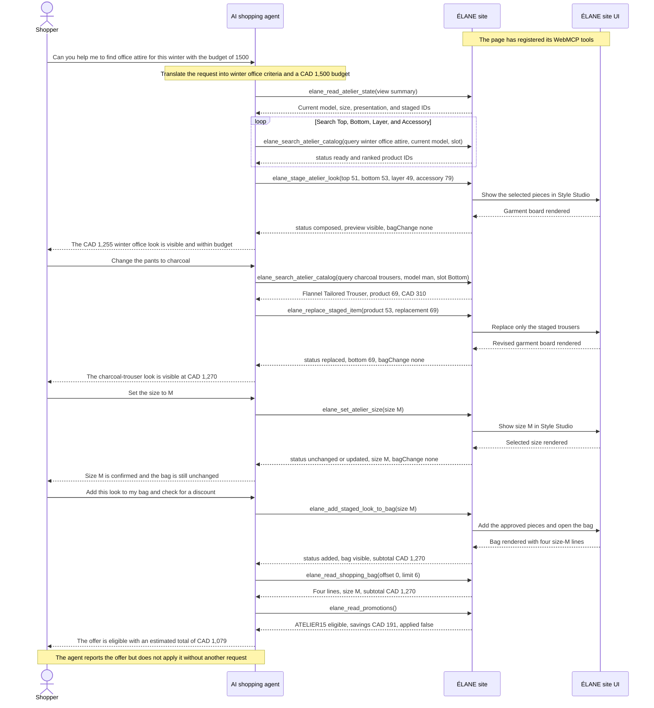

# ÉLANE Clothing Boutique

[](LICENSE)
[](https://elane-clothing-boutique.karanrajs.chatgpt.site)

ÉLANE is a proof of agent-ready commerce: one clothing boutique designed for people to browse visually and for AI agents to help those people complete a shopping task. A shopper can plan outfits for several occasions while accounting for budget, weather, dress code, colour preferences, and clothes they already own. The same editorial storefront exposes 19 native WebMCP tools for structured catalog discovery, styling, sizing, promotion, and shopping-bag actions.

**[Open the live application](https://elane-clothing-boutique.karanrajs.chatgpt.site)**


## WebMCP case study

### User goal

A shopper begins with: “Can you help me to find office attire for this winter with the budget of 1500”. The agent turns that broad intent into a practical winter look within the shopper’s CAD 1,500 budget using the current site context and ÉLANE’s structured catalog data. The shopper can then guide the result with simple follow-up requests: change the trouser colour, set the size, add the approved look to the bag, and check for an eligible discount.

### Why this is a strong fit for WebMCP

Fashion shopping is a stateful, multi-step task. The agent must translate the shopper’s climate and dress-code context into garment searches, compare structured product attributes, assemble compatible slots, preserve the current look while replacing one item, track the selected size, distinguish staging from a bag mutation, and evaluate a promotion against the resulting subtotal.

A visual storefront remains important for photography, editorial discovery, and the character of the retailer. It is not, however, a dependable data contract for an agent: products, sizes, and offers may be distributed across collection pages, drawers, banners, and bag screens. WebMCP lets ÉLANE expose those existing site capabilities as explicit tools while keeping the human interface intact.

### How WebMCP creates a better user experience

Instead of translating a shopping goal into filters, page navigation, and repeated comparisons, the shopper can describe the outcome they want. The agent uses ÉLANE’s structured catalog and store actions to find matching pieces, compose a visible look, respond to style changes, confirm sizing, and evaluate available offers in the same storefront.

Every step remains visible and bounded. The shopper reviews the recommendation, refines the style, and decides what enters the bag, while the agent handles structured discovery, product matching, and store-specific actions. This reduces navigation and comparison work without removing the retailer’s visual experience or the shopper’s control.

### Initial state and boundaries

- The shopper is viewing ÉLANE, where the page has already registered its WebMCP tools.
- Catalog, state, bag, and promotion reads return structured information without changing the page.
- Staging and replacing garments update the visible Style Studio but never change the shopping bag.
- Adding the look requires an explicit shopper request. Reading an eligible promotion does not authorize applying it.
- Checkout is demonstrational; the site does not collect payment or place an order.

### What the shopper and agent do together

1. The shopper states a broad goal. The agent turns it into working search criteria and begins with read-only store tools.
2. The agent reads the current Style Studio state and searches the catalog by collection, garment slot, colour, season, and product intent.
3. The agent stages a proposed look. ÉLANE updates the visible garment board and returns a structured result confirming that the bag did not change.
4. The shopper asks to change the trousers from brown to charcoal. The agent searches for a compatible charcoal `Bottom` and replaces only that staged item.
5. The shopper chooses size M. The agent sets or confirms the visible Style Studio size without touching the bag.
6. The shopper explicitly asks to add the look and check for a discount. The agent adds the staged pieces, verifies the visible bag, and reads promotion eligibility.
7. The agent explains the eligible offer and estimated savings. Applying the code would require a separate shopper instruction.

This collaboration was difficult to make reliable with screen navigation alone. The shopper contributes intent, taste, corrections, and approval; the agent contributes structured search, constraint tracking, site-specific actions, and calculation. Both work against the same visible page state.

### What was verified

In the shopper-observed interaction, the agent translated the broad office-attire request into a starting recommendation and used ÉLANE’s site tools to present it in the visible Style Studio.

A separate WebMCP runtime test verified structured catalog search, staging the initial look, replacing only the trousers, confirming size M, adding the approved look to the bag, reading the bag, and evaluating promotion eligibility. It also confirmed the visible Style Studio and bag updates, the `bagChange: none` boundary during staging, and the final CAD totals.

### How WebMCP is implemented

ÉLANE registers 19 imperative, page-scoped tools from [`app/components/atelier-webmcp.tsx`](app/components/atelier-webmcp.tsx). The component feature-detects `document.modelContext`, registers closed input schemas and side-effect annotations, and uses an `AbortController` for lifecycle cleanup. There is no remote WebMCP server in this architecture.

Each tool delegates to a validated handler in [`app/page.tsx`](app/page.tsx). Read-only handlers return structured catalog, state, bag, or promotion data without changing the UI. Mutating handlers update the same React state used by the human interface, wait for the relevant visible transition, and then return a concise result to the agent. [`app/webmcp-contract.ts`](app/webmcp-contract.ts) enforces pagination and output budgets, while [`scripts/verify-webmcp.mjs`](scripts/verify-webmcp.mjs) checks the registered surface for drift.

## Technology

- React 19 and Next.js-compatible App Router APIs
- Vinext and Vite for a Cloudflare Workers-compatible build
- TypeScript in strict mode
- Tailwind CSS 4 for the CSS processing pipeline
- Native imperative WebMCP
- OpenAI Sites hosting configuration

Node.js 22.13 or newer is required.

## Local setup

```bash
git clone https://github.com/karanrajs/elane-clothing-boutique.git
cd elane-clothing-boutique
npm ci
npm run dev
```

Open the local URL printed by Vinext. No environment variables or external services are required for the current experience.

### Available commands

| Command | Purpose |
| --- | --- |
| `npm run dev` | Start the local Vinext development server. |
| `npm run build` | Produce the production Cloudflare-compatible build. |
| `npm run start` | Start the built application. |

## Architecture

```text
app/
├── page.tsx                         UI, client state, validation, and tool handlers
├── catalog.ts                      Catalog data, search ranking, slots, and asset mapping
├── webmcp-contract.ts              Shared pagination and output-budget invariants
├── components/
│   └── atelier-webmcp.tsx          WebMCP schemas, registration, and lifecycle
├── globals.css                     Shared theme and responsive interface styles
└── layout.tsx                      Metadata and document shell

public/
├── garment-board-layers/           Individual transparent garment assets
├── garment-board-sprites/          Catalog-wide garment-board sprite sheets
└── elane-*.{jpg,png}                Storefront catalog and brand imagery
```

The browser is the application boundary. Catalog rules live in `catalog.ts`, visible shopping state and validated actions live in `page.tsx`, and `atelier-webmcp.tsx` is the thin WebMCP adapter between an agent and that state. WebMCP remains an enhancement: browsers without `document.modelContext` still receive the complete human-operated storefront.

## WebMCP tool inventory

### Catalog and styling

| Tool | Kind | Purpose |
| --- | --- | --- |
| `elane_read_atelier_catalog` | Read | Return one catalog page with IDs, prices, slots, and compatibility rules. |
| `elane_read_atelier_state` | Read | Return one compact view of the current look, capsule, constraints, or customer product lists. |
| `elane_search_atelier_catalog` | Read | Return one ranked page for a natural-language name, colour, garment, or style search. |
| `elane_stage_atelier_look` | Stage | Replace the visible board with one validated women’s or men’s look. |
| `elane_set_atelier_size` | Configure | Change the displayed size without changing the bag. |
| `elane_add_staged_item` | Configure | Add one compatible product to an empty slot in the current look. |
| `elane_remove_staged_item` | Configure | Remove one unlocked product from the current look. |
| `elane_replace_staged_item` | Configure | Replace one product with another from the same collection and slot. |

### Capsule planning

| Tool | Kind | Purpose |
| --- | --- | --- |
| `elane_stage_capsule_journey` | Stage | Batch-stage two to four occasion-specific looks with an optional budget. |
| `elane_replan_capsule` | Configure | Atomically revise a capsule while preserving locked pieces and applying new constraints. |

### Shopping bag

| Tool | Kind | Purpose |
| --- | --- | --- |
| `elane_read_shopping_bag` | Read | Return one page of bag lines plus quantities, sizes, and CAD totals. |
| `elane_read_promotions` | Read | Return authoritative promotion terms and current-bag eligibility without changing state. |
| `elane_apply_promotion` | Configure | Apply an eligible promotion code to the visible bag totals after user intent. |
| `elane_add_catalog_item_to_bag` | Complete | Add one catalog item directly to the bag. |
| `elane_add_staged_look_to_bag` | Complete | Add every item in the current look or a selected capsule look. |
| `elane_adjust_bag_item_quantity` | Configure | Increase or decrease one bag line by one unit. |
| `elane_set_bag_item_size` | Configure | Change the size of one existing bag line. |
| `elane_remove_bag_items` | Configure | Remove selected product lines. |
| `elane_clear_shopping_bag` | Configure | Clear the complete bag after an explicit request. |

## Example agent-assisted shopping sequence

This example shows the agent translating a broad request into working search criteria, then using the WebMCP flow verified against the live site. The shopper remains involved by reviewing the visible result, refining the trouser colour, confirming the size, and explicitly approving the bag change.



## State and production boundaries

- The staged look or capsule, active look, locks, owned and excluded pieces, size, and bag are saved in versioned `localStorage` and restored after refresh on the same browser and device. There is no account or cross-device sync.
- Checkout is a demonstration; there is no payment processor, account system, database, or order submission.
- Product styling uses a garment-only editorial board, not body or fit simulation.

## License

Source code is available under the [MIT License](LICENSE). ÉLANE names and visual assets are included as project demonstration material.
