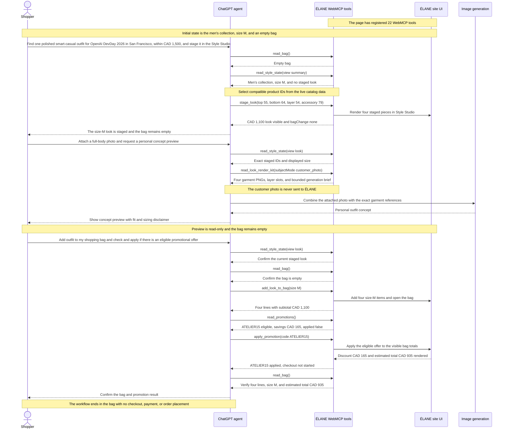

# ÉLANE Clothing Boutique

[](LICENSE)
[](https://elane-clothing-boutique.karanrajs.chatgpt.site)

This project is a demo fashion boutique website built to show how WebMCP can improve online shopping. A customer can browse the website normally or use their own AI agent to find clothes, build an outfit, and preview a personal look.

**[Open the live application](https://elane-clothing-boutique.karanrajs.chatgpt.site)**


## Local setup

```bash
git clone https://github.com/karanrajs/elane-webmcp-boutique.git
cd elane-webmcp-boutique
npm ci
npm run dev
```

Open the local URL printed by Vinext. No environment variables or external services are required for the current experience.

### Verification

- **Hosted app:** open the [live application](https://elane-clothing-boutique.karanrajs.chatgpt.site) in ChatGPT desktop’s in-app browser. No login or credentials are required.
- **Google Chrome:** use Chrome 149 or later, enable `chrome://flags/#enable-webmcp-testing`, restart Chrome, and open the live application.
- **WebMCP flow:** use the three prompts in the [final demo sequence](#final-demo-sequence). Confirm that staging leaves the bag empty, `read_look_render_kit` is read-only, the four items are added only after the final prompt, and the flow ends at CAD 935 without checkout.
- **Repository validation:** after `npm ci`, run `npm run check` to execute type checking, linting, WebMCP contract verification, asset verification, and a production build.

## Example sequence

Example Sequence : build a look, create a personal concept preview, and complete only the shopping actions the shopper explicitly approves.

1. **Prompt 1:** “Can you help me find one polished smart-casual outfit for OpenAI DevDay 2026 in San Francisco, within a budget of CAD 1,500, and stage it in the Style Studio?”
2. **Prompt 2:** “On the ÉLANE Style Studio page I already have open, create a complete preview of my currently staged outfit on me. If I have not already attached a clear full-body photo in this conversation, ask me to attach one first. Generate the finished image here. Treat it as a visual concept, not proof of fit or sizing.”
3. **Prompt 3:** “Add outfit to my shopping bag and check and apply if there is an eligible promotional offer.”

Prompt 1 authorizes catalog and Style Studio work, not a bag change. Prompt 2 authorizes a concept image inside the agent conversation; the ÉLANE website receives no customer photo and its render-kit tool remains read-only. Prompt 3 authorizes adding the staged look, checking the current bag against authoritative offer terms, and applying an eligible offer. Nothing authorizes checkout, payment, or order placement.



### Available commands

| Command | Purpose |
| --- | --- |
| `npm run dev` | Start the local Vinext development server. |
| `npm run generate:agent-preview-assets` | Rebuild the per-product PNG references used by Agent Try-On. |
| `npm run typecheck` | Check the strict TypeScript build without emitting files. |
| `npm run lint` | Run the repository lint rules. |
| `npm run verify:webmcp` | Verify the 22-tool inventory, schemas, annotations, lifecycle, output budgets, README parity, and preview assets. |
| `npm run check` | Run type checking, linting, WebMCP verification, and the production build. |
| `npm run build` | Produce the production Cloudflare-compatible build. |
| `npm run start` | Start the built application. |

## Architecture

```text
app/
├── page.tsx                         UI, client state, validation, and tool handlers
├── catalog.ts                      Catalog data, search ranking, slots, and asset mapping
├── policies.ts                     Terms, returns, refunds, and date-check authority
├── returns/page.tsx                Customer-facing delivery and returns policy
├── terms/page.tsx                  Customer-facing terms and conditions
├── webmcp-contract.ts              Shared pagination and output-budget invariants
├── components/
│   ├── atelier-webmcp.tsx          Storefront WebMCP registration and lifecycle
│   └── policy-webmcp.tsx           Shared policy tools and legal-route registration
├── globals.css                     Shared theme and responsive interface styles
└── layout.tsx                      Metadata and document shell

public/
├── agent-preview-assets/           Stable transparent garment PNGs for external agents
├── garment-board-layers/           Individual transparent garment assets
├── garment-board-sprites/          Catalog-wide garment-board sprite sheets
└── elane-*.{jpg,png}                Storefront catalog and brand imagery
```

The browser is the application boundary. Catalog rules live in `catalog.ts`, visible shopping state and validated actions live in `page.tsx`, and `atelier-webmcp.tsx` is the thin WebMCP adapter between an agent and that state. WebMCP remains an enhancement: browsers without `document.modelContext` still receive the complete human-operated storefront.

## WebMCP tool inventory

The 22 storefront tools are grouped by how they affect the shopping experience. Sensitive write tools change promotion or shopping-bag state and require clear shopper intent; `read_look_render_kit` is read-only and does not receive customer photos or generate images itself.

Tool identifiers use concise, verb-first `snake_case` and stay within WebMCP’s portable name character set. Registrations omit the optional `title`, allowing ChatGPT to show the identifier as the heading, derive Read or Write from `readOnlyHint`, and place the tool description beneath it.

### Catalog and styling

| Tool | Kind | Purpose |
| --- | --- | --- |
| `read_catalog` | Read | Return a compact overview by default or dense, proof-complete product pages for exhaustive reads. |
| `read_style_state` | Read | Return one compact view of the current look, capsule, constraints, or customer product lists. |
| `read_look_render_kit` | Read | Return the active staged outfit as agent-ready garment images and a bounded preview brief. |
| `search_catalog` | Read | Return one ranked page for a natural-language name, colour, garment, or style search. |
| `stage_look` | Stage | Replace the visible board with one validated women’s or men’s look. |
| `set_look_size` | Configure | Change the displayed size without changing the bag. |
| `add_look_item` | Configure | Add one compatible product to an empty slot in the current look. |
| `remove_look_item` | Configure | Remove one unlocked product from the current look. |
| `replace_look_item` | Configure | Replace one product with another from the same collection and slot. |

### Advanced capsule planning (optional)

The core WebMCP journey works with one staged look and does not depend on capsule planning. Use these advanced tools only when a shopper needs coordinated options for two or more occasions, shared-piece budget accounting, or a constraint-aware replan.

| Tool | Kind | Purpose |
| --- | --- | --- |
| `stage_capsule` | Stage | Batch-stage two to four occasion-specific looks with an optional budget. |
| `replan_capsule` | Configure | Atomically revise a capsule while preserving locked pieces and applying new constraints. |

### Shopping bag

| Tool | Kind | Purpose |
| --- | --- | --- |
| `read_bag` | Read | Return one page of bag lines plus quantities, sizes, and CAD totals. |
| `read_promotions` | Read | Return authoritative promotion terms and current-bag eligibility without changing state. |
| `read_policy` | Read | Read terms, returns, refunds, delivery, order, or promotion conditions from the shared policy authority. |
| `check_return_window` | Read | Calculate a return deadline and assess supplied item conditions without authorizing a return. |
| `apply_promotion` | Configure | Apply an eligible promotion code to the visible bag totals after user intent. |
| `add_item_to_bag` | Complete | Add one catalog item directly to the bag. |
| `add_look_to_bag` | Complete | Add every item in the current look or a selected capsule look. |
| `adjust_bag_quantity` | Configure | Increase or decrease one bag line by one unit. |
| `set_bag_item_size` | Configure | Change the size of one existing bag line. |
| `remove_bag_items` | Configure | Remove selected product lines. |
| `clear_bag` | Configure | Clear the complete bag after an explicit request. |


## Technology

- React 19 and Next.js-compatible App Router APIs
- Vinext and Vite for a Cloudflare Workers-compatible build
- TypeScript in strict mode
- Tailwind CSS 4 for the CSS processing pipeline
- Native imperative WebMCP

Node.js 22.13 or newer is required.

## State and production boundaries

- The staged look or capsule, active look, locks, owned and excluded pieces, size, and bag are saved in versioned `localStorage` and restored after refresh on the same browser and device. There is no account or cross-device sync.
- Checkout is a demonstration; there is no payment processor, account system, database, or order submission.
- Product styling uses a garment-only editorial board, not body or fit simulation.
- Personal preview generation happens in a compatible external agent. WebMCP tool provides garment references but does not receive the customer photo, generate the preview, or claim exact fit.

## License

Source code is available under the [MIT License](LICENSE). ÉLANE names and visual assets are included as project demonstration material.
