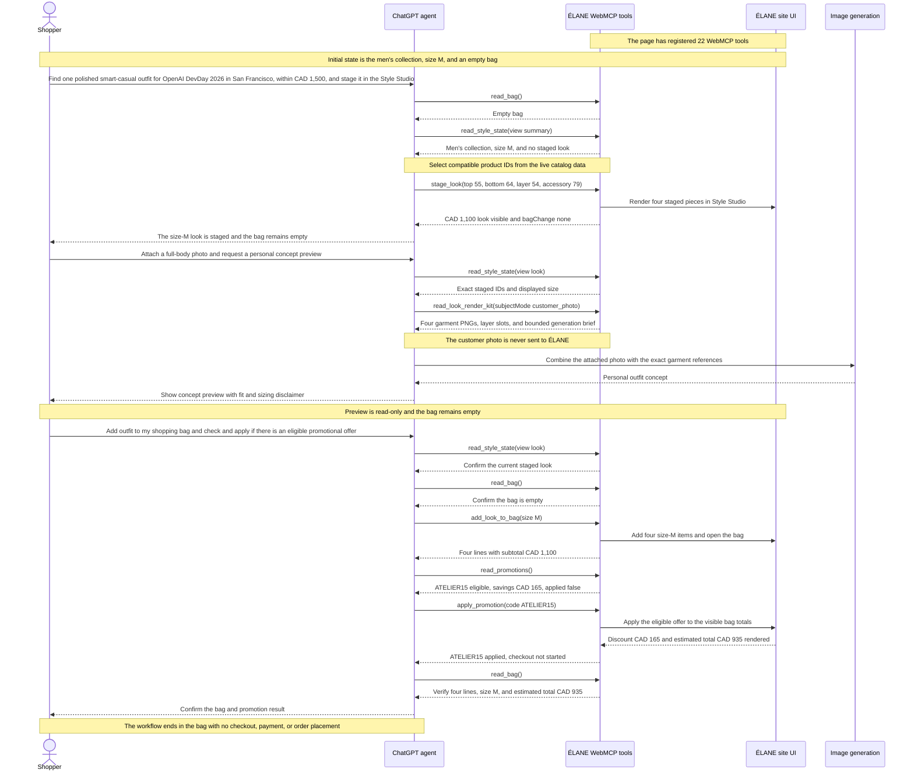

# ÉLANE Clothing Boutique

[](LICENSE)
[](https://elane-clothing-boutique.karanrajs.chatgpt.site)

ÉLANE is a premium clothing boutique where people can browse visually, while an AI agent can help them complete more complex shopping tasks. WebMCP does not replace the website or the shopping experience. It connects the agent to the same catalog, Style Studio, agent-ready garment references, shopping bag, promotions, and store policies that the shopper can see.

**[Open the live application](https://elane-clothing-boutique.karanrajs.chatgpt.site)**


## WebMCP case study

### Why this is a strong fit for WebMCP

One main reason ÉLANE is a strong fit for WebMCP is the personal outfit preview. The website knows the exact clothes staged in the Style Studio. The customer’s own image-generating agent can use a photo already shared in the conversation. WebMCP connects these two parts, so the agent does not need to guess the clothes from a screenshot and the customer does not need to upload their photo to ÉLANE.

The idea is simple: **bring your own agent**. First, the customer builds a look on the website or asks the agent to stage one. Then they can ask any compatible image-generating agent to preview that exact outfit. The read-only `read_look_render_kit` tool gives the agent one garment image for every staged item, along with the collection, selected size, layer information, and a short generation instruction.

The customer’s photo stays only in the agent conversation. ÉLANE does not receive or store it. The agent uses the photo and garment references to create a personal outfit concept. This helps the customer imagine the complete look before buying, but it is not a promise of exact fit, size, material, or appearance.

This is why WebMCP is useful for ÉLANE. The agent works with the same live Style Studio information the customer can see instead of trying to understand the page from screenshots. After viewing the personal preview, the customer can continue with the same agent to change the look, check the bag, find an eligible offer, or approve a shopping action. The customer stays in control of their photo, style choices, and shopping decisions while the agent handles the structured work.

### How WebMCP creates a better user experience

Instead of working through filters and comparing many products manually, the shopper can simply describe the result they want.

In the final demo, the shopper begins with:

> “Can you help me find one polished smart-casual outfit for OpenAI DevDay 2026 in San Francisco, within a budget of CAD 1,500, and stage it in the Style Studio?”

The agent reads the current shopping state and stages a complete four-piece men’s look in size M: an Ink Unstructured Wool Blazer, Ivory Relaxed Poplin Shirt, Stone Single-Pleat Chino, and Espresso Woven Leather Belt. The look costs CAD 1,100, which is within the shopper’s budget. The shopping bag remains empty because staging an outfit is only a preview.

The shopper attaches a clear full-body photo to the agent conversation and uses the personal-preview prompt copied from the Style Studio:

> “On the ÉLANE Style Studio page I already have open, create a complete preview of my currently staged outfit on me. If I have not already attached a clear full-body photo in this conversation, ask me to attach one first. Generate the finished image here. Treat it as a visual concept, not proof of fit or sizing.”

The agent calls `read_look_render_kit` to receive the exact staged garment images, displayed size, layer slots, and a bounded generation brief. A compatible image-generating agent then creates the personal outfit concept inside the conversation. The website never receives the customer photo, and the shopping bag is still empty.

After reviewing the concept, the shopper makes a separate request:

> “Add outfit to my shopping bag and check and apply if there is an eligible promotional offer.”

This request clearly gives permission to add the outfit and apply an eligible offer. The agent rechecks the staged look and bag, adds the four pieces in size M, evaluates the promotion terms, applies ATELIER15, and verifies the updated bag. The visible result is a CAD 1,100 subtotal, a CAD 165 discount, and a CAD 935 estimated total. The demo stops before checkout, payment, or order placement.

### Initial state and boundaries

- The shopper is viewing ÉLANE in ChatGPT’s in-app browser. The page has registered 22 WebMCP tools, the Style Studio is set to the men’s collection and size M, and the bag is empty.
- Catalog, state, bag, promotion, and policy reads return structured information without changing the page.
- Staging or refining garments updates the visible Style Studio but never changes the shopping bag.
- `read_look_render_kit` returns garment references only. It does not receive the customer photo or generate an image; the photo and generated concept stay in the agent conversation.
- Adding the look and applying a promotion require clear shopper permission. In the final demo, the shopper explicitly asks the agent to check and apply an eligible offer.
- Checkout is demonstrational; the site does not collect payment or place an order.

### What people and agents can do together

ÉLANE gives the shopper and the agent one shared and visible working state.

The shopper provides the personal part of the decision: the occasion, budget, style preference, photo, and approval. The website provides structured catalog data, current state, exact garment references, safe write actions, promotion rules, and policy information. The agent connects those capabilities, keeps the shopper informed, and creates the personal concept outside the website.

1. The shopper asks for one polished smart-casual outfit for OpenAI DevDay 2026 within a CAD 1,500 budget.
2. The agent reads the current Style Studio and bag state, uses the live catalog, and stages a four-piece look costing CAD 1,100. The shopping bag remains empty.
3. The shopper attaches a full-body photo to the agent conversation and asks for a preview of the staged outfit.
4. The website’s read-only render-kit tool returns the four exact garment images and generation guidance. The agent combines those references with the attached photo and returns a personal concept preview without sending the photo to ÉLANE.
5. The shopper explicitly asks the agent to add the outfit, check for an eligible offer, and apply it.
6. The agent adds four size-M items, verifies the bag, and applies ATELIER15. The visible estimated total becomes CAD 935 after a CAD 165 discount.

The result is one continuous flow from discovery to a personal visual concept and then to controlled shopping. The shopper sees the same Style Studio and shopping bag state the agent is using, while sensitive content stays in the conversation where it was supplied.

This is difficult to make reliable through screen navigation alone. An agent would otherwise need to infer product information, selected items, sizes, image references, prices, and bag state from different parts of the interface. WebMCP provides structured results, so both the shopper and the agent can understand what was selected, what was visualized, what changed, and what still needs approval.

ÉLANE also includes optional capsule-planning tools for shoppers who need coordinated outfits for several occasions. However, the main demo stays focused on the simpler and more common journey of building one outfit.

### Agent Try-On: bring your own agent

After staging a look, the shopper can ask any compatible image-generating agent to call `read_look_render_kit`. The read-only tool returns one stable, public PNG reference for every staged garment plus the collection, displayed size, layer slot, and a concise generation instruction. The agent can render the outfit on an editorial model or use a customer photo supplied directly in that agent conversation.

ÉLANE never receives or stores the customer photo in this flow. The generated image is a visual concept rather than evidence of exact fit, sizing, proportions, texture, or drape. The visible Style Studio includes copyable prompts for both preview modes and clearly communicates these boundaries.

### What was verified

The verified storefront registers 22 tools directly from the website: eight read tools and fourteen write tools. Used ChatGPT desktop’s WebMCP-capable in-app browser and visibly demonstrates shared state, `read_look_render_kit`, the personal concept preview, explicit bag mutation, promotion application, and the complete tool inventory. Contract checks cover structured catalog search, state and asset reads, staging boundaries, shopping-bag actions, promotions, policy reads, output budgets, and one generated preview asset for every catalog product.

### How WebMCP is implemented

ÉLANE registers 22 native, imperative storefront tools from [`app/components/atelier-webmcp.tsx`](app/components/atelier-webmcp.tsx): eight read tools and fourteen write tools. The Delivery & Returns route also mounts the relevant `read_policy` and `check_return_window` tools through [`app/components/policy-webmcp.tsx`](app/components/policy-webmcp.tsx).

Both components feature-detect `document.modelContext`, register closed input schemas and side-effect annotations, and use an `AbortController` for lifecycle cleanup. There is no remote WebMCP server in this architecture.

Each tool calls a validated handler in [`app/page.tsx`](app/page.tsx). Read-only handlers return structured catalog, state, bag, promotion, or policy information without changing the UI. Mutating handlers update the same React state used by the human interface, wait for the related visible transition, and then return a concise result. This helps the agent’s response match what the shopper can see.

The storefront keeps its Agent activity section hidden during ordinary browsing. The first WebMCP invocation reveals a page-session-only history containing the tool identifier, Read or Write classification, and lifecycle status. Tool inputs, outputs, errors, and personal content are not displayed or persisted in that history.

[`app/policies.ts`](app/policies.ts) is the shared authority for the visible legal pages and date-aware return checks. [`app/webmcp-contract.ts`](app/webmcp-contract.ts) enforces pagination and output budgets, while [`scripts/verify-webmcp.mjs`](scripts/verify-webmcp.mjs) checks the registered surface and Agent Try-On assets for drift. [`scripts/generate-agent-preview-assets.mjs`](scripts/generate-agent-preview-assets.mjs) deterministically exports the catalog sprite crops as one transparent PNG per product.

### How Codex was used

Codex helped build and refine the storefront, add the native WebMCP contracts, test the visible human-agent workflow, audit safety boundaries, and keep the implementation, demo, and documentation aligned. The important product decisions remained human-directed: use shared visible state, keep preview separate from shopping, keep customer photos out of ÉLANE, and require explicit intent before bag or promotion changes.

### Search-first, proof-complete catalog discovery

ÉLANE treats pagination as reliability infrastructure rather than a feature to showcase. `read_catalog` defaults to a compact `overview` containing collection counts, garment-slot facets, the price range, compatibility rules, and explicit routing guidance. For an ordinary shopping request, the agent then calls `search_catalog` with the shopper’s intent, collection, garment slot, and budget instead of walking the complete catalog.

When exhaustive coverage is genuinely required, the same `read_catalog` tool accepts `view: products` and returns denser eight-product pages. Each page includes `totalCount` and `nextOffset`, so an agent can prove that it reached the end without receiving a silently truncated result. Ranked search remains capped at six richer results per page. Both paths stay below ÉLANE’s 1,300-character safety target and 1,500-character hard response limit.

This two-lane contract is the distinctive implementation choice: **ranked search for shopper speed, deterministic pagination for completeness**. It preserves the 22-tool surface, avoids a decorative overview tool, reduces a full 88-product read from 15 calls to 11, and keeps every catalog response bounded enough for dependable agent reasoning.

## Technology

- React 19 and Next.js-compatible App Router APIs
- Vinext and Vite for a Cloudflare Workers-compatible build
- TypeScript in strict mode
- Tailwind CSS 4 for the CSS processing pipeline
- Native imperative WebMCP
- A portable application build with no OpenAI Sites configuration required

Node.js 22.13 or newer is required.

## Local setup

```bash
git clone https://github.com/karanrajs/elane-webmcp-boutique.git
cd elane-webmcp-boutique
npm ci
npm run dev
```

Open the local URL printed by Vinext. No environment variables or external services are required for the current experience.

### Deployment portability

The public repository is not tied to one hosting account. A fresh clone can run and build without `.openai/hosting.json`, an OpenAI Sites project ID, environment variables, or external services. The original Sites configuration stays local and is ignored by Git, so it is not included in public commits.

`npm run build` produces the current Cloudflare Workers-compatible output. Other hosting services can use the same application source, but may need their own Vinext or Vite deployment adapter and platform configuration.

### Judge testing

- **Hosted app:** open the [live application](https://elane-clothing-boutique.karanrajs.chatgpt.site) in ChatGPT desktop’s in-app browser. No login or credentials are required.
- **Google Chrome:** use Chrome 149 or later, enable `chrome://flags/#enable-webmcp-testing`, restart Chrome, and open the live application.
- **WebMCP flow:** use the three prompts in the [final demo sequence](#final-demo-sequence). Confirm that staging leaves the bag empty, `read_look_render_kit` is read-only, the four items are added only after the final prompt, and the flow ends at CAD 935 without checkout.
- **Repository validation:** after `npm ci`, run `npm run check` to execute type checking, linting, WebMCP contract verification, asset verification, and a production build.

### Available commands

| Command | Purpose |
| --- | --- |
| `npm run dev` | Start the local Vinext development server. |
| `npm run generate:agent-preview-assets` | Rebuild the per-product PNG references used by Agent Try-On. |
| `npm run typecheck` | Check the strict TypeScript build without emitting files. |
| `npm run lint` | Run the repository lint rules. |
| `npm run verify:webmcp` | Verify the 22-tool inventory, schemas, annotations, lifecycle, output budgets, README parity, and preview assets. |
| `npm run check` | Run type checking, linting, WebMCP verification, and the production build. |
| `npm run build` | Produce the production Cloudflare-compatible build. |
| `npm run start` | Start the built application. |

## Architecture

```text
app/
├── page.tsx                         UI, client state, validation, and tool handlers
├── catalog.ts                      Catalog data, search ranking, slots, and asset mapping
├── policies.ts                     Terms, returns, refunds, and date-check authority
├── returns/page.tsx                Customer-facing delivery and returns policy
├── terms/page.tsx                  Customer-facing terms and conditions
├── webmcp-contract.ts              Shared pagination and output-budget invariants
├── components/
│   ├── atelier-webmcp.tsx          Storefront WebMCP registration and lifecycle
│   └── policy-webmcp.tsx           Shared policy tools and legal-route registration
├── globals.css                     Shared theme and responsive interface styles
└── layout.tsx                      Metadata and document shell

public/
├── agent-preview-assets/           Stable transparent garment PNGs for external agents
├── garment-board-layers/           Individual transparent garment assets
├── garment-board-sprites/          Catalog-wide garment-board sprite sheets
└── elane-*.{jpg,png}                Storefront catalog and brand imagery
```

The browser is the application boundary. Catalog rules live in `catalog.ts`, visible shopping state and validated actions live in `page.tsx`, and `atelier-webmcp.tsx` is the thin WebMCP adapter between an agent and that state. WebMCP remains an enhancement: browsers without `document.modelContext` still receive the complete human-operated storefront.

## WebMCP tool inventory

The 22 storefront tools are grouped by how they affect the shopping experience. Sensitive write tools change promotion or shopping-bag state and require clear shopper intent; `read_look_render_kit` is read-only and does not receive customer photos or generate images itself.

Tool identifiers use concise, verb-first `snake_case` and stay within WebMCP’s portable name character set. Registrations omit the optional `title`, allowing ChatGPT to show the identifier as the heading, derive Read or Write from `readOnlyHint`, and place the tool description beneath it.

### Catalog and styling

| Tool | Kind | Purpose |
| --- | --- | --- |
| `read_catalog` | Read | Return a compact overview by default or dense, proof-complete product pages for exhaustive reads. |
| `read_style_state` | Read | Return one compact view of the current look, capsule, constraints, or customer product lists. |
| `read_look_render_kit` | Read | Return the active staged outfit as agent-ready garment images and a bounded preview brief. |
| `search_catalog` | Read | Return one ranked page for a natural-language name, colour, garment, or style search. |
| `stage_look` | Stage | Replace the visible board with one validated women’s or men’s look. |
| `set_look_size` | Configure | Change the displayed size without changing the bag. |
| `add_look_item` | Configure | Add one compatible product to an empty slot in the current look. |
| `remove_look_item` | Configure | Remove one unlocked product from the current look. |
| `replace_look_item` | Configure | Replace one product with another from the same collection and slot. |

### Advanced capsule planning (optional)

The core WebMCP journey works with one staged look and does not depend on capsule planning. Use these advanced tools only when a shopper needs coordinated options for two or more occasions, shared-piece budget accounting, or a constraint-aware replan.

| Tool | Kind | Purpose |
| --- | --- | --- |
| `stage_capsule` | Stage | Batch-stage two to four occasion-specific looks with an optional budget. |
| `replan_capsule` | Configure | Atomically revise a capsule while preserving locked pieces and applying new constraints. |

### Shopping bag

| Tool | Kind | Purpose |
| --- | --- | --- |
| `read_bag` | Read | Return one page of bag lines plus quantities, sizes, and CAD totals. |
| `read_promotions` | Read | Return authoritative promotion terms and current-bag eligibility without changing state. |
| `read_policy` | Read | Read terms, returns, refunds, delivery, order, or promotion conditions from the shared policy authority. |
| `check_return_window` | Read | Calculate a return deadline and assess supplied item conditions without authorizing a return. |
| `apply_promotion` | Configure | Apply an eligible promotion code to the visible bag totals after user intent. |
| `add_item_to_bag` | Complete | Add one catalog item directly to the bag. |
| `add_look_to_bag` | Complete | Add every item in the current look or a selected capsule look. |
| `adjust_bag_quantity` | Configure | Increase or decrease one bag line by one unit. |
| `set_bag_item_size` | Configure | Change the size of one existing bag line. |
| `remove_bag_items` | Configure | Remove selected product lines. |
| `clear_bag` | Configure | Clear the complete bag after an explicit request. |

## Final demo sequence

The final 2:44 demo shows one three-prompt journey: build a look, create a personal concept preview, and complete only the shopping actions the shopper explicitly approves.

1. **Prompt 1:** “Can you help me find one polished smart-casual outfit for OpenAI DevDay 2026 in San Francisco, within a budget of CAD 1,500, and stage it in the Style Studio?”
2. **Prompt 2:** “On the ÉLANE Style Studio page I already have open, create a complete preview of my currently staged outfit on me. If I have not already attached a clear full-body photo in this conversation, ask me to attach one first. Generate the finished image here. Treat it as a visual concept, not proof of fit or sizing.”
3. **Prompt 3:** “Add outfit to my shopping bag and check and apply if there is an eligible promotional offer.”

Prompt 1 authorizes catalog and Style Studio work, not a bag change. Prompt 2 authorizes a concept image inside the agent conversation; the ÉLANE website receives no customer photo and its render-kit tool remains read-only. Prompt 3 authorizes adding the staged look, checking the current bag against authoritative offer terms, and applying an eligible offer. Nothing authorizes checkout, payment, or order placement.



[Open the static PNG version of the sequence diagram](public/elane-webmcp-sequence-diagram.png).

## State and production boundaries

- The staged look or capsule, active look, locks, owned and excluded pieces, size, and bag are saved in versioned `localStorage` and restored after refresh on the same browser and device. There is no account or cross-device sync.
- Checkout is a demonstration; there is no payment processor, account system, database, or order submission.
- Product styling uses a garment-only editorial board, not body or fit simulation.
- Personal preview generation happens in a compatible external agent. ÉLANE provides garment references but does not receive the customer photo, generate the preview, or claim exact fit.

## License

Source code is available under the [MIT License](LICENSE). ÉLANE names and visual assets are included as project demonstration material.
