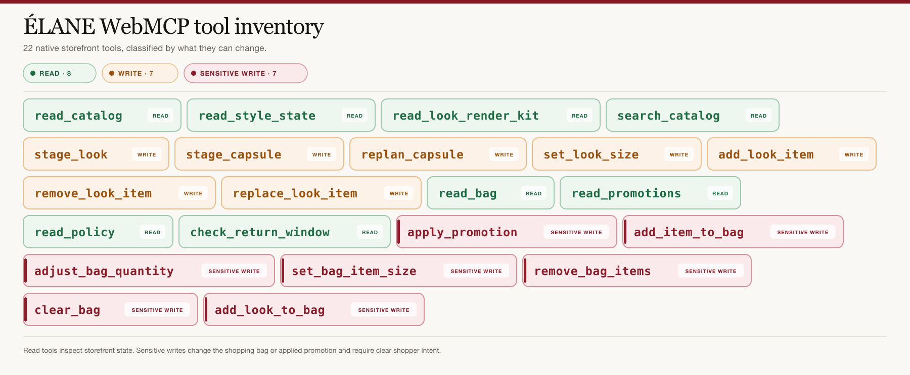
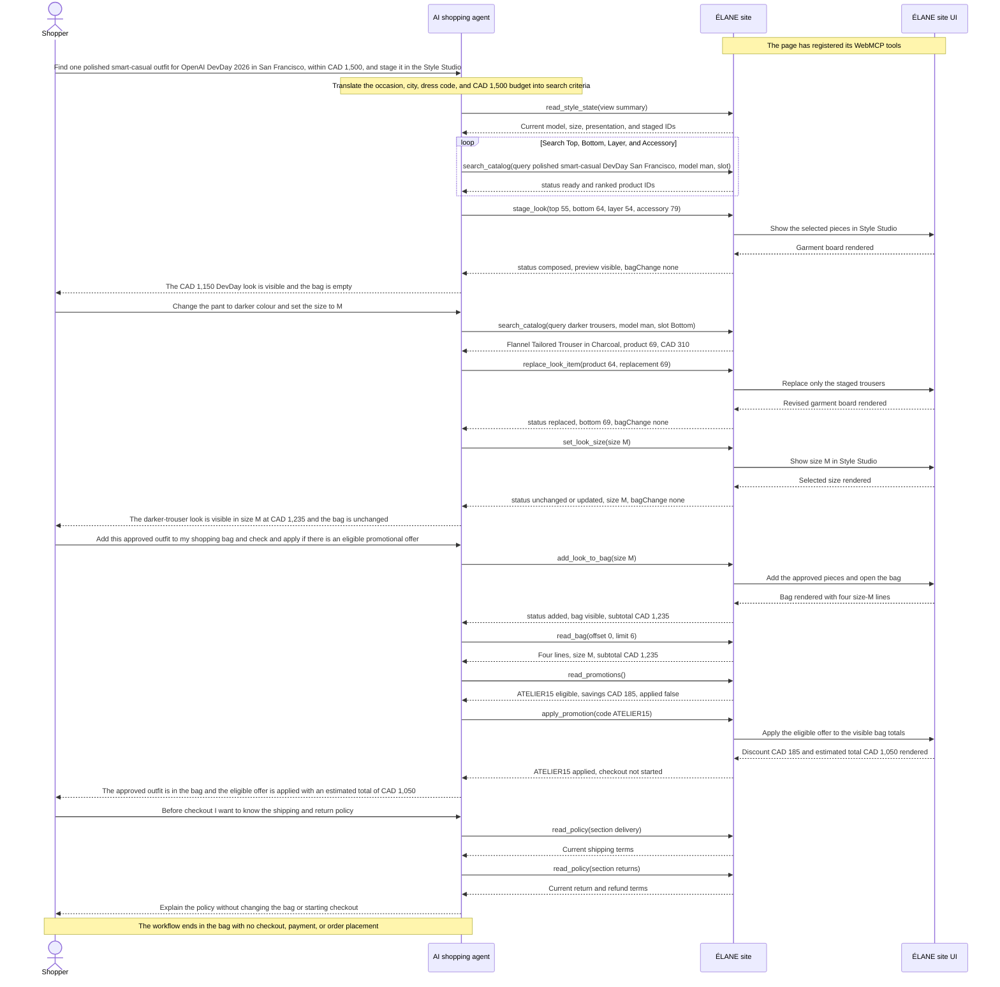

# ÉLANE Clothing Boutique

[](LICENSE)
[](https://elane-clothing-boutique.karanrajs.chatgpt.site)

ÉLANE is a premium clothing boutique where people can browse visually, while an AI agent can help them complete more complex shopping tasks. WebMCP does not replace the website or the shopping experience. It connects the agent to the same catalog, Style Studio, shopping bag, promotions, and store policies that the shopper can see.

**[Open the live application](https://elane-clothing-boutique.karanrajs.chatgpt.site)**


## WebMCP case study

### Why this is a strong fit for WebMCP

Fashion shopping is rarely a one-step task. A shopper may need an outfit for a specific event, location, season, dress code, colour preference, size, and budget. They may also want to change only one item without losing the rest of the outfit.

On a normal storefront, this information is spread across collection pages, product details, filters, promotional banners, policy pages, and the shopping bag. An agent using only screen navigation has to repeatedly read the interface and guess what the current state is.

WebMCP gives ÉLANE a more reliable way to share these capabilities with an agent. The agent can search structured product information, stage a compatible outfit, replace one garment, set the size, read the bag, check promotions, and answer policy questions using tools provided directly by the website.

The visual storefront is still important. The shopper can see every recommendation and decide whether it matches their taste.

### How WebMCP creates a better user experience

Instead of working through filters and comparing many products manually, the shopper can simply describe the result they want.

In the final demo, the shopper begins with:

> “Can you help me find one polished smart-casual outfit for OpenAI DevDay 2026 in San Francisco, within a budget of CAD 1,500, and stage it in the Style Studio?”

The agent searches ÉLANE’s catalog and stages a complete four-piece look in the visible Style Studio. The first look costs CAD 1,150, which is within the shopper’s budget. The shopping bag remains empty because staging an outfit is only a preview.

The shopper then asks:

> “Change the pant to darker colour and set the size to M.”

The agent replaces only the stone trousers with charcoal trousers. It keeps the blazer, polo, and belt unchanged. The updated outfit costs CAD 1,235, the selected size is M, and the bag is still empty.

When the shopper approves the outfit, they make a separate request:

> “Add this approved outfit to my shopping bag and check and apply if there is an eligible promotional offer.”

This request clearly gives permission to add the outfit and apply an eligible offer. The agent adds the four pieces to the bag in size M, checks the promotion terms, and applies ATELIER15. The bag shows a subtotal of CAD 1,235, a discount of CAD 185, and an estimated total of CAD 1,050.

Before continuing, the shopper also asks:

> “Before checkout I want to know the shipping and return policy.”

The agent reads the store’s current policy and explains it without leaving the shopping experience or changing the bag.

### Initial state and boundaries

- The shopper is viewing ÉLANE, where the page has already registered its WebMCP tools.
- Catalog, state, bag, promotion, and policy reads return structured information without changing the page.
- Staging and replacing garments update the visible Style Studio but never change the shopping bag.
- Adding the look and applying a promotion require clear shopper permission. In the final demo, the shopper explicitly asks the agent to check and apply an eligible offer.
- Checkout is demonstrational; the site does not collect payment or place an order.

### What people and agents can do together

ÉLANE gives the shopper and the agent one shared and visible working state.

The shopper provides the personal part of the decision: the occasion, budget, style preference, colour changes, size, and approval. The agent handles structured catalog searches, product compatibility, totals, bag actions, promotion eligibility, and policy information.

1. The shopper asks for one polished smart-casual outfit for OpenAI DevDay 2026 within a CAD 1,500 budget.
2. The agent reads the current Style Studio state, searches the catalog, and stages a four-piece look costing CAD 1,150. The shopping bag remains empty.
3. The shopper asks for darker trousers and size M. The agent replaces only the trousers, preserves the other pieces, and updates the total to CAD 1,235 without changing the bag.
4. The shopper approves the outfit and explicitly asks the agent to add it, check for an eligible offer, and apply it.
5. The agent adds four size-M items, verifies the bag, and applies ATELIER15. The visible estimated total becomes CAD 1,050 after a CAD 185 discount.
6. Before checkout, the shopper asks about shipping and returns. The agent reads and explains the current store policy without starting checkout.

This means the shopper can ask for one precise change without starting again. In the demo, changing the trousers does not remove or replace the other approved pieces. The shopper can also see the Style Studio and shopping bag update while the agent is working.

This is difficult to make reliable through screen navigation alone. An agent would otherwise need to infer product information, selected items, sizes, prices, and bag state from different parts of the interface. WebMCP provides structured results, so both the shopper and the agent can understand what was selected, what changed, and what still needs approval.

ÉLANE also includes optional capsule-planning tools for shoppers who need coordinated outfits for several occasions. However, the main demo stays focused on the simpler and more common journey of building one outfit.

### What was verified

The final demo shows ChatGPT recognizing 21 tools directly from the website. It shows structured catalog search, the initial four-piece look, a trouser-only replacement, size M, four approved bag items, ATELIER15 application, and a policy read before checkout. The visible results confirm the CAD 1,235 subtotal, CAD 185 discount, CAD 1,050 estimated total, and the `bagChange: none` boundary while styling.

The demo ends before checkout. No payment is collected and no order is placed.

### How WebMCP is implemented

ÉLANE registers 21 native, imperative storefront tools from [`app/components/atelier-webmcp.tsx`](app/components/atelier-webmcp.tsx). In the final demo, ChatGPT recognizes seven read tools and fourteen write tools directly from the website. The Delivery & Returns route also mounts the relevant `read_policy` and `check_return_window` tools through [`app/components/policy-webmcp.tsx`](app/components/policy-webmcp.tsx).

Both components feature-detect `document.modelContext`, register closed input schemas and side-effect annotations, and use an `AbortController` for lifecycle cleanup. There is no remote WebMCP server in this architecture.

Each tool calls a validated handler in [`app/page.tsx`](app/page.tsx). Read-only handlers return structured catalog, state, bag, promotion, or policy information without changing the UI. Mutating handlers update the same React state used by the human interface, wait for the related visible transition, and then return a concise result. This helps the agent’s response match what the shopper can see.

[`app/policies.ts`](app/policies.ts) is the shared authority for the visible legal pages and date-aware return checks. [`app/webmcp-contract.ts`](app/webmcp-contract.ts) enforces pagination and output budgets, while [`scripts/verify-webmcp.mjs`](scripts/verify-webmcp.mjs) checks the registered surface for drift.

### Search-first, proof-complete catalog discovery

ÉLANE treats pagination as reliability infrastructure rather than a feature to showcase. `read_catalog` defaults to a compact `overview` containing collection counts, garment-slot facets, the price range, compatibility rules, and explicit routing guidance. For an ordinary shopping request, the agent then calls `search_catalog` with the shopper’s intent, collection, garment slot, and budget instead of walking the complete catalog.

When exhaustive coverage is genuinely required, the same `read_catalog` tool accepts `view: products` and returns denser eight-product pages. Each page includes `totalCount` and `nextOffset`, so an agent can prove that it reached the end without receiving a silently truncated result. Ranked search remains capped at six richer results per page. Both paths stay below ÉLANE’s 1,300-character safety target and 1,500-character hard response limit.

This two-lane contract is the distinctive implementation choice: **ranked search for shopper speed, deterministic pagination for completeness**. It preserves the existing 21-tool surface, avoids a decorative overview tool, reduces a full 88-product read from 15 calls to 11, and keeps every catalog response bounded enough for dependable agent reasoning.

## Technology

- React 19 and Next.js-compatible App Router APIs
- Vinext and Vite for a Cloudflare Workers-compatible build
- TypeScript in strict mode
- Tailwind CSS 4 for the CSS processing pipeline
- Native imperative WebMCP
- OpenAI Sites hosting configuration

Node.js 22.13 or newer is required.

## Local setup

```bash
git clone https://github.com/karanrajs/elane-clothing-boutique.git
cd elane-clothing-boutique
npm ci
npm run dev
```

Open the local URL printed by Vinext. No environment variables or external services are required for the current experience.

### Available commands

| Command | Purpose |
| --- | --- |
| `npm run dev` | Start the local Vinext development server. |
| `npm run build` | Produce the production Cloudflare-compatible build. |
| `npm run start` | Start the built application. |

## Architecture

```text
app/
├── page.tsx                         UI, client state, validation, and tool handlers
├── catalog.ts                      Catalog data, search ranking, slots, and asset mapping
├── policies.ts                     Terms, returns, refunds, and date-check authority
├── returns/page.tsx                Customer-facing delivery and returns policy
├── terms/page.tsx                  Customer-facing terms and conditions
├── webmcp-contract.ts              Shared pagination and output-budget invariants
├── components/
│   ├── atelier-webmcp.tsx          Storefront WebMCP registration and lifecycle
│   └── policy-webmcp.tsx           Shared policy tools and legal-route registration
├── globals.css                     Shared theme and responsive interface styles
└── layout.tsx                      Metadata and document shell

public/
├── garment-board-layers/           Individual transparent garment assets
├── garment-board-sprites/          Catalog-wide garment-board sprite sheets
└── elane-*.{jpg,png}                Storefront catalog and brand imagery
```

The browser is the application boundary. Catalog rules live in `catalog.ts`, visible shopping state and validated actions live in `page.tsx`, and `atelier-webmcp.tsx` is the thin WebMCP adapter between an agent and that state. WebMCP remains an enhancement: browsers without `document.modelContext` still receive the complete human-operated storefront.

## WebMCP tool inventory



*The 21 storefront tools are grouped by how they affect the shopping experience. Sensitive write tools change promotion or shopping-bag state and require clear shopper intent.*

Tool identifiers use concise, verb-first `snake_case` and stay within WebMCP’s portable name character set. Registrations omit the optional `title`, allowing ChatGPT to show the identifier as the heading, derive Read or Write from `readOnlyHint`, and place the tool description beneath it.

### Catalog and styling

| Tool | Kind | Purpose |
| --- | --- | --- |
| `read_catalog` | Read | Return a compact overview by default or dense, proof-complete product pages for exhaustive reads. |
| `read_style_state` | Read | Return one compact view of the current look, capsule, constraints, or customer product lists. |
| `search_catalog` | Read | Return one ranked page for a natural-language name, colour, garment, or style search. |
| `stage_look` | Stage | Replace the visible board with one validated women’s or men’s look. |
| `set_look_size` | Configure | Change the displayed size without changing the bag. |
| `add_look_item` | Configure | Add one compatible product to an empty slot in the current look. |
| `remove_look_item` | Configure | Remove one unlocked product from the current look. |
| `replace_look_item` | Configure | Replace one product with another from the same collection and slot. |

### Advanced capsule planning (optional)

The core WebMCP journey works with one staged look and does not depend on capsule planning. Use these advanced tools only when a shopper needs coordinated options for two or more occasions, shared-piece budget accounting, or a constraint-aware replan.

| Tool | Kind | Purpose |
| --- | --- | --- |
| `stage_capsule` | Stage | Batch-stage two to four occasion-specific looks with an optional budget. |
| `replan_capsule` | Configure | Atomically revise a capsule while preserving locked pieces and applying new constraints. |

### Shopping bag

| Tool | Kind | Purpose |
| --- | --- | --- |
| `read_bag` | Read | Return one page of bag lines plus quantities, sizes, and CAD totals. |
| `read_promotions` | Read | Return authoritative promotion terms and current-bag eligibility without changing state. |
| `read_policy` | Read | Read terms, returns, refunds, delivery, order, or promotion conditions from the shared policy authority. |
| `check_return_window` | Read | Calculate a return deadline and assess supplied item conditions without authorizing a return. |
| `apply_promotion` | Configure | Apply an eligible promotion code to the visible bag totals after user intent. |
| `add_item_to_bag` | Complete | Add one catalog item directly to the bag. |
| `add_look_to_bag` | Complete | Add every item in the current look or a selected capsule look. |
| `adjust_bag_quantity` | Configure | Increase or decrease one bag line by one unit. |
| `set_bag_item_size` | Configure | Change the size of one existing bag line. |
| `remove_bag_items` | Configure | Remove selected product lines. |
| `clear_bag` | Configure | Clear the complete bag after an explicit request. |

## Example agent-assisted shopping sequence

This is the four-prompt journey shown in the final demo video. It shows the agent turning an occasion and budget into a staged look, making one precise revision, completing the bag and promotion actions the shopper approves, and reading store policy before checkout.

1. **Prompt 1:** “Can you help me find one polished smart-casual outfit for OpenAI DevDay 2026 in San Francisco, within a budget of CAD 1,500, and stage it in the Style Studio?”
2. **Prompt 2:** “Change the pant to darker colour and set the size to M.”
3. **Prompt 3:** “Add this approved outfit to my shopping bag and check and apply if there is an eligible promotional offer.”
4. **Prompt 4:** “Before checkout I want to know the shipping and return policy.”

Prompt 1 authorizes research and Style Studio staging, not a bag change. Prompt 2 authorizes the trouser replacement and Style Studio size change. Prompt 3 authorizes adding the approved outfit, checking the current bag against authoritative offer terms, and applying an eligible offer. Prompt 4 is read-only and does not authorize checkout, payment, or order placement.



## State and production boundaries

- The staged look or capsule, active look, locks, owned and excluded pieces, size, and bag are saved in versioned `localStorage` and restored after refresh on the same browser and device. There is no account or cross-device sync.
- Checkout is a demonstration; there is no payment processor, account system, database, or order submission.
- Product styling uses a garment-only editorial board, not body or fit simulation.

## License

Source code is available under the [MIT License](LICENSE). ÉLANE names and visual assets are included as project demonstration material.
